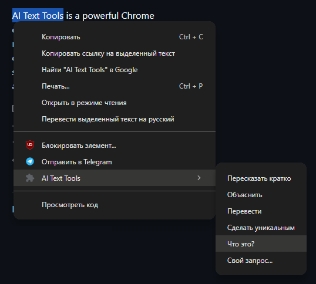
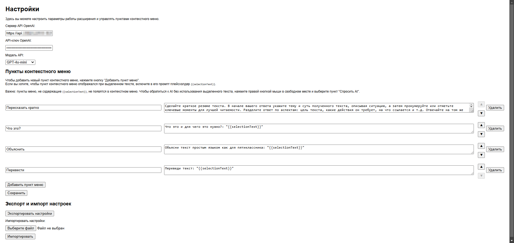
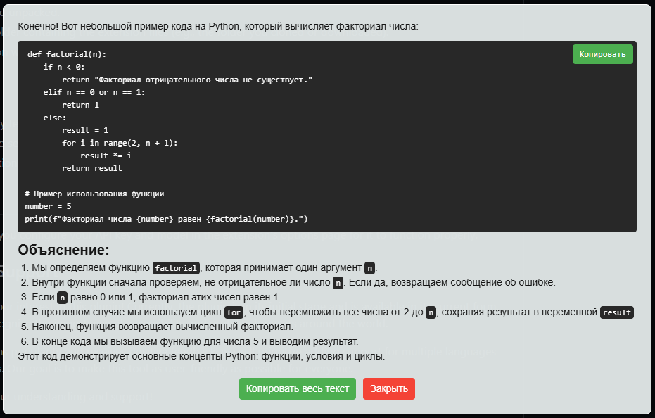

<h1 align="center">AI Text Tools</h1>

AI Text Tools is a Chrome/Edge extension designed to enhance productivity by offering AI-based context menu options for various text manipulations like translation, summarization, and explanation.

## Features
- **Customizable Prompts**: Easily add, edit, or delete context menu items through the settings page.
- **User-Friendly UI**: A clean and intuitive options page for managing API keys and settings.

## Screenshots
### Main Features

### Settings Page

### AI Results Popup

## Installation
- Open your Chrome browser and navigate to chrome://extensions/.
- Enable Developer Mode (toggle in the top-right corner).
- Click on Load unpacked.
- Select the folder containing the extension files (e.g., the folder you cloned or downloaded).
- The extension will now appear in your browser's extension list.

## Usage
- Highlight any text on a webpage.
- Right-click to see the new context menu options provided by the extension.
- Select an action like "Summarize" or "Translate" to process the text using AI.

## Note
- Ensure that you configure your API key and model in the extension's options page for it to function properly.

## Language Support
We appreciate your interest in this plugin! Currently, the plugin is in its initial stage and is available in its current form. However, we recognize the importance of accessibility and usability for users around the world.

If this plugin gains popularity and receives positive feedback, we will prioritize adding support for multiple languages in future updates. Our goal is to make this tool as user-friendly as possible for everyone.

Thank you for your understanding and support!
*