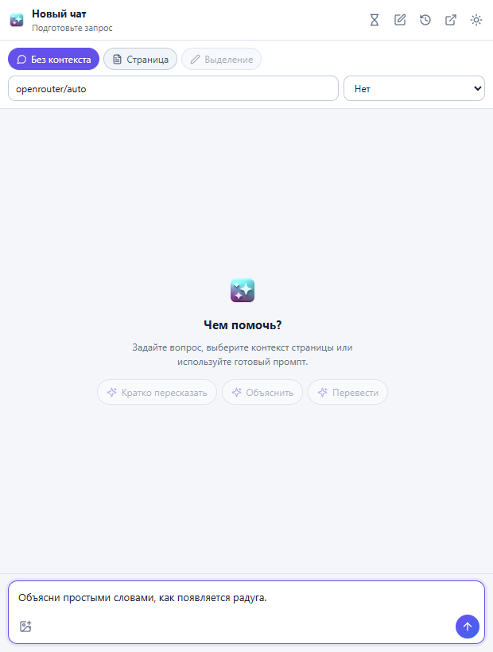
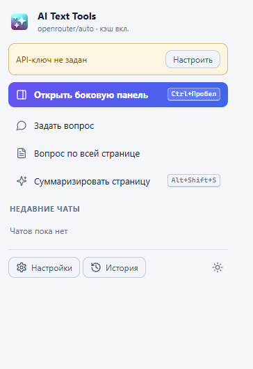
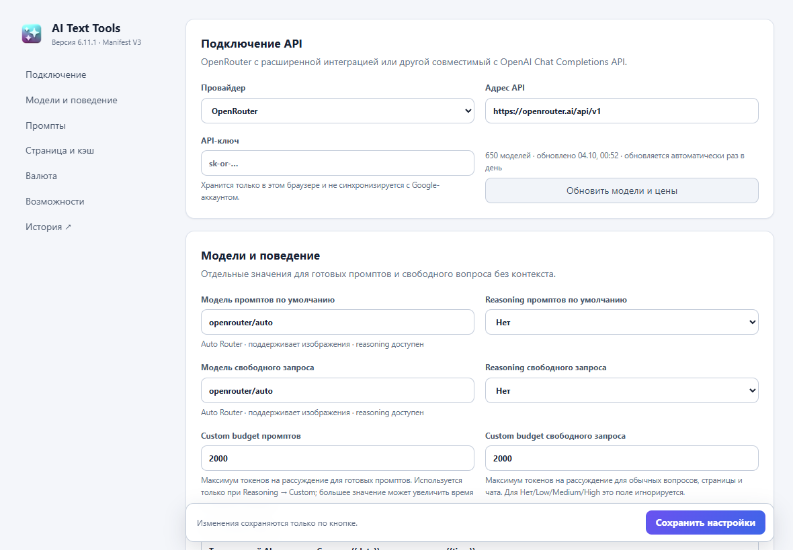

<div align="center">
  
  <h1>AI Text Tools</h1>
  <p><strong>Выделите текст. Задайте вопрос. Продолжите разговор.</strong></p>
  <p>AI-помощник для веб-страниц · Версия 6.11.1 · Chrome Manifest V3</p>
</div>

Переводите, объясняйте, редактируйте и суммируйте текст прямо в браузере. Выбирайте контекст: выделенный фрагмент, открытую страницу или изображения. Расширение работает с **OpenRouter** и **OpenAI-совместимыми Chat Completions API**; модель и провайдера выбираете вы.

## Как выглядит



| Быстрые действия | Настройки |
| --- | --- |
|  |  |

Скриншоты версии 6.11.1 сняты в отдельном чистом профиле. API-ключ не задан; демонстрационный текст не содержит личных данных.

## Возможности

- **Контекст рядом с вопросом:** свободный запрос, выделение или страница; отдельное действие суммаризации. Выделение обновляется в панели. Длинный текст можно обрезать до лимита или отправить целиком.
- **Полноценный диалог:** потоковый ответ, остановка, продолжение беседы, альтернативная регенерация, редактирование пользовательских сообщений. Прерванный ответ сохраняется с отметкой «неполный».
- **Боковая панель и отдельное окно:** один чат для всех вкладок или собственный чат для каждой вкладки; настраиваемая ширина отдельного окна.
- **Изображения:** файлы, вставка из буфера и drag-and-drop; локальное уменьшение перед отправкой. Нужна модель с поддержкой зрения.
- **Markdown, код и формулы:** подсветка, копирование, перенос строк кода, локальный KaTeX. Светлая, тёмная и системная темы для всех окон.
- **Модели и Reasoning:** поиск по каталогу OpenRouter, избранные и недавние модели, цены и возможности. Отдельные настройки для свободного запроса, промптов и следующего ответа.
- **История:** сохранённые диалоги можно открыть и продолжить. Временный чат не попадает в постоянную историю; рабочая сессия удаляется при закрытии панели или окна.
- **Стоимость:** ответ и весь диалог по данным OpenRouter; доллары или рубли по ежедневному либо ручному курсу. Отдельные настройки для чата, меню, истории и каталога моделей.
- **Свои промпты:** готовые действия, импорт/экспорт настроек и переменные `{{selectionText}}`, `{{pageText}}`, `{{pageTitle}}`, `{{pageUrl}}`, `{{date}}`, `{{time}}`.

В **6.11.1** добавлен общий переключатель переноса строк кода для чата и истории. Каталог OpenRouter и валютный курс обновляются автоматически раз в день.

## Установка

1. Скачайте **Code → Download ZIP**, распакуйте архив. Или выполните `git clone https://github.com/MBudkin/AI-Text-Tools.git`.
2. Откройте `chrome://extensions/`, включите **Режим разработчика**.
3. Нажмите **Загрузить распакованное расширение**, выберите папку с `manifest.json`.
4. Откройте настройки AI Text Tools через меню или карточку расширения.
5. Выберите провайдера, адрес API, свой ключ и модель; нажмите **Сохранить**.

OpenRouter использует адрес `https://openrouter.ai/api/v1`. Для другого сервиса нужен совместимый Chat Completions API и поддерживаемое им имя модели. Ключ и оплачиваемый баланс предоставляет выбранный сервис; стоимость зависит от его условий.

Основной целевой браузер — актуальный Chrome для компьютера. В Edge аналогичная установка доступна на `edge://extensions/`; необходима поддержка Side Panel API.

**Обновление:** замените файлы, нажмите обновление на карточке расширения и перезагрузите открытые страницы, чтобы подключился новый content script.

## Первый запрос

1. Откройте обычную веб-страницу, выделите интересующий фрагмент.
2. Нажмите **Ctrl + Space**.
3. Выберите контекст, введите «Объясни этот фрагмент простыми словами» и отправьте запрос.
4. Продолжайте беседу, смените модель, приложите изображение или перенесите чат в отдельное окно.

Готовые промпты доступны в контекстном меню и пустом чате. Быстрые действия и недавние диалоги — в меню значка расширения.

| Действие | По умолчанию |
| --- | --- |
| Открыть AI-панель | `Ctrl + Space` (macOS: `Command + Shift + Space`) |
| Вопрос по странице | `Alt + Shift + A` |
| Суммаризация | `Alt + Shift + S` |
| Остановить генерацию в панели/окне | `Esc` |

Измените сочетания на `chrome://extensions/shortcuts`. Отправка через **Enter** либо **Ctrl + Enter** выбирается в настройках; сочетание новой строки зависит от выбранного режима.

## Данные и разрешения

API-ключ хранится в `chrome.storage.local` этого профиля и не синхронизируется. Это локальное хранилище, а не зашифрованный менеджер секретов. Перед отправкой проверьте контекст: вопрос, выбранный текст, вложения и сообщения диалога передаются **на настроенный API**. История хранится локально.

Экспорт может включить ключ **только после отдельного подтверждения**. Не публикуйте такой файл. Внешние изображения из ответов автоматически не загружаются.

| Разрешение | Назначение |
| --- | --- |
| `contextMenus` | Действия по выделению и странице |
| `activeTab`, `scripting`, `<all_urls>` | Контекст страниц и доступ к настроенному API |
| `tabs`, `sidePanel` | Привязка чата к вкладке и боковая панель |
| `storage`, `unlimitedStorage` | Настройки, история, вложения |
| `alarms` | Обновление каталога моделей и курса |

## Ограничения и решение проблем

- **Нет ответа:** проверьте ключ, баланс, адрес API и модель. Совместимость других сервисов зависит от их реализации Chat Completions.
- **Не читается страница:** служебные страницы `chrome://`, магазин расширений и некоторые PDF-просмотрщики недоступны. Извлечение из iframe/shadow DOM зависит от доступности содержимого.
- **Изображения или Reasoning недоступны:** требуется соответствующая поддержка модели. Уровни и лимит Reasoning зависят от модели.
- **Кэш и стоимость:** возможности относятся к OpenRouter и зависят от провайдера. Стабильный `session_id` помогает sticky routing; cache hit не гарантируется.
- **Рубли:** автоматические источники — `cbr-xml-daily.ru` и `open.er-api.com`; при сбоях можно задать курс вручную. Конвертация меняет отображение, расчёты API остаются в долларах.

## Разработка и сборка

Обычные HTML/CSS/JavaScript. Установка npm-зависимостей и отдельная сборка **не нужны**: браузер загружает исходники напрямую.

```sh
node tests/smoke.mjs
```

Проверяются ресурсы манифеста, связь интерфейса и скриптов, миграции, обработчики, контекст, история и запросы на тестовых ответах. Платные API-запросы тест не выполняет.

| Файлы | Назначение |
| --- | --- |
| `manifest.json`, `background.js` | Манифест, сервис-воркер, API и состояние чатов |
| `content.js` | Выделение и содержимое страницы |
| `sidepanel.*`, `popup.*`, `history.*`, `options.*` | Панель, меню, история, настройки |
| `common.js`, `theme.css` | Общие компоненты и оформление |
| `marked.min.js`, `vendor/katex/` | Локальные Markdown и формулы |
| `icon*.png`, `assets/` | Значки и скриншоты |
| `tests/smoke.mjs` | Автономные smoke-проверки |

Для переносимого ZIP включите манифест, корневые `.js`, `.html`, `theme.css`, значки и **всю папку `vendor/`**. Документация, тесты, `.git`, профили браузера и личные настройки в пакет не нужны. ZIP следует распаковать перед установкой.

## Ссылки и библиотеки

- [Обновления и исходники](https://github.com/MBudkin/AI-Text-Tools)
- [Сообщить о проблеме](https://github.com/MBudkin/AI-Text-Tools/issues)
- [RouteHub — каталог программ и инструкций](https://routehub.top/)
- [AI Text Tools на RouteHub](https://routehub.top/programs/useful/ai-text-tools) — на момент проверки требует входа.

Marked v15.0.3 и KaTeX распространяются по MIT. Заголовок лицензии Marked сохранён в `marked.min.js`, лицензия KaTeX — в [`vendor/katex/LICENSE`](vendor/katex/LICENSE). Отдельная лицензия авторского кода пока не указана.
